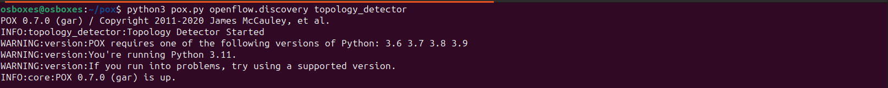
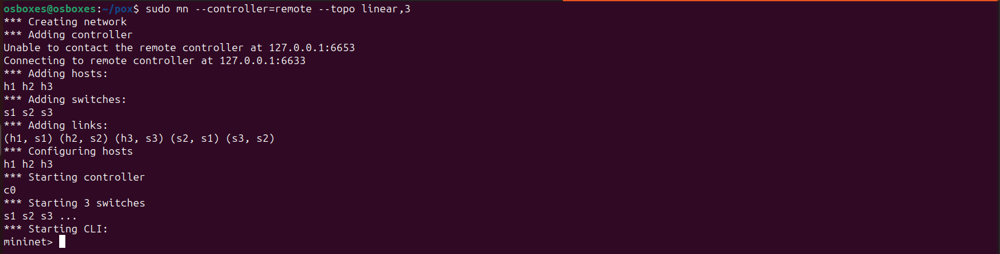
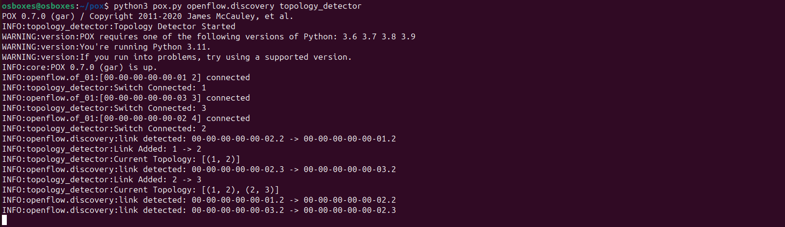
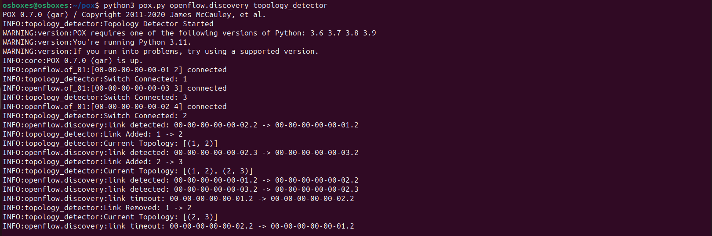
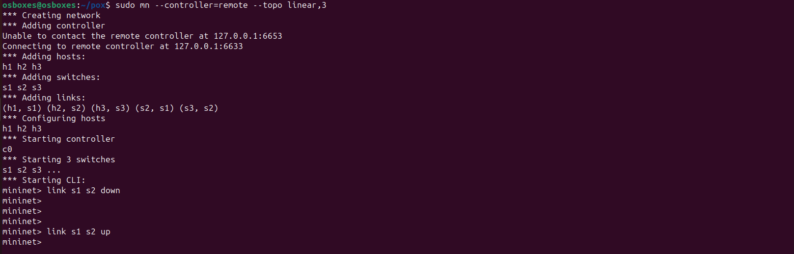
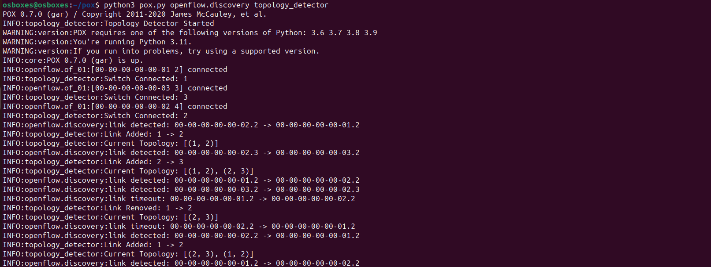

# 🌐 CN-Orange | Task 21 — SDN Topology Change Detector

> **Course:** Computer Networks | **Controller:** POX | **Simulator:** Mininet  
> **Student:** KSHITIJ SATISH SHETTY | **SRN:** PES1UG24AM143 | **Problem:** Orange SDN Mininet Simulation

---

## 📌 Problem Statement

Implement a **Topology Change Detector** using an SDN controller (POX) and Mininet that:

- 🔍 Monitors switch and link events **dynamically** in real time
- 🗺️ Maintains and **updates** an in-memory topology map on every change
- 📋 **Displays and logs** all topology additions and removals

---

## 🏗️ Topology

```
 h1 ── [s1] ── [s2] ── [s3] ── h3
               |
               h2
```

| Element  | Count | Details                         |
|----------|-------|---------------------------------|
| Switches | 3     | s1, s2, s3 (linear topology)    |
| Hosts    | 3     | h1 (→s1), h2 (→s2), h3 (→s3)   |
| Links    | 2     | s1–s2, s2–s3                    |

---

## ⚙️ Setup & Execution

### Prerequisites

| Software | Version     |
|----------|-------------|
| Python   | 3.11        |
| POX      | 0.7.0 (gar) |
| Mininet  | 2.3+        |
| OS       | Ubuntu 22.04|

### Installation

```bash
# Clone POX
git clone https://github.com/noxrepo/pox.git ~/pox

# Copy module into POX
cp topology_detector.py ~/pox/ext/

# Install Mininet
sudo apt-get install mininet -y
```

---

### ▶️ Running

**Terminal 1 — Start POX Controller**
```bash
cd ~/pox
python3 pox.py openflow.discovery topology_detector
```

**Terminal 2 — Start Mininet**
```bash
sudo mn --controller=remote --topo linear,3
```

---

## 🧪 Test Scenarios

### ✅ Scenario 1 — Normal Link Discovery

After both terminals are running, switches connect and links are auto-discovered via LLDP:

```
INFO:topology_detector:Switch Connected: 1
INFO:topology_detector:Switch Connected: 2
INFO:topology_detector:Switch Connected: 3
INFO:topology_detector:Link Added: 1 -> 2
INFO:topology_detector:Current Topology: [(1, 2)]
INFO:topology_detector:Link Added: 2 -> 3
INFO:topology_detector:Current Topology: [(1, 2), (2, 3)]
```

---

### ❌➡️✅ Scenario 2 — Link Failure & Recovery

From Mininet CLI:
```bash
mininet> link s1 s2 down    # simulate failure
mininet> link s1 s2 up      # simulate recovery
```

**On failure:**
```
INFO:topology_detector:Link Removed: 1 -> 2
INFO:topology_detector:Current Topology: [(2, 3)]
```

**On recovery:**
```
INFO:topology_detector:Link Added: 1 -> 2
INFO:topology_detector:Current Topology: [(2, 3), (1, 2)]
```

---

## 🖼️ Proof of Execution

### 1️⃣ POX Controller Started


---

### 2️⃣ Mininet Topology Created


---

### 3️⃣ Switches Connected & Links Discovered


---

### 4️⃣ Link Failure Detected


---

### 5️⃣ Mininet `link down` / `link up` Commands


---

### 6️⃣ Full Lifecycle (Discovery → Failure → Recovery)


---

## 🧠 How It Works

```
┌──────────────────────────────────────┐
│           POX Controller             │
│  ┌────────────────────────────────┐  │
│  │   TopologyDetector (module)    │  │
│  │  • _handle_ConnectionUp        │  │
│  │  • _handle_LinkEvent           │  │
│  └────────────────────────────────┘  │
│   openflow.discovery  (LLDP-based)   │
└──────────────┬───────────────────────┘
               │  OpenFlow / LLDP
  ┌────────────┼────────────┐
  ▼            ▼            ▼
 [s1]         [s2]         [s3]
  │            │            │
 [h1]         [h2]         [h3]
```

### Key Design Decisions

| Decision | Reason |
|---|---|
| `tuple(sorted([dpid1, dpid2]))` | Prevents duplicate links like (1,2) and (2,1) |
| Event-driven — no polling | Reacts instantly to `ConnectionUp` and `LinkEvent` |
| Suppress packet/DNS logs | Keeps topology events clearly visible in terminal |

---

## 📊 SDN Concepts Demonstrated

| Concept | Implementation |
|---|---|
| Controller–Switch Interaction | `_handle_ConnectionUp` logs every switch join |
| OpenFlow Event Handling | `_handle_LinkEvent` reacts to LLDP discovery |
| Dynamic Topology Awareness | In-memory list updated on every add/remove |
| Link Failure Detection | Timeout events trigger automatic topology update |

---

## 📚 References

1. [POX Documentation](https://noxrepo.github.io/pox-doc/html/)
2. [Mininet Walkthrough](http://mininet.org/walkthrough/)
3. [OpenFlow Specification v1.0](https://opennetworking.org/wp-content/uploads/2013/04/openflow-spec-v1.0.0.pdf)
4. B. Lantz, B. Heller, N. McKeown, *"A Network in a Laptop"*, HotNets 2010
5. [POX GitHub Repository](https://github.com/noxrepo/pox)
